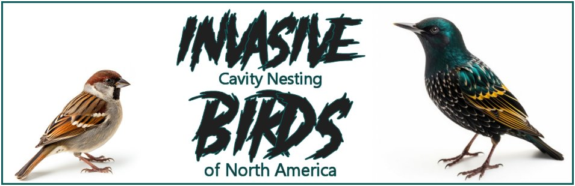

# Invasive Birds Project  

## Overview

North America has several introduced invasive birds species. Among the most common are feral Pigeons (Rock Doves), Eurasian Collared Doves, and Ring-necked Pheasants. This project concerns only invasive cavity nesting birds. The species of focus are the House Sparrow (aka English Sparrow), the European Starling, and the Eurasian Tree Sparrow.

---
*Note: House Finches, which are cavity nesters, are considered invasive in many regions of North America. However, they **are** native to North Amercia, and thus shall not be considered invasive for the purposes of this study.*

---

## Background
